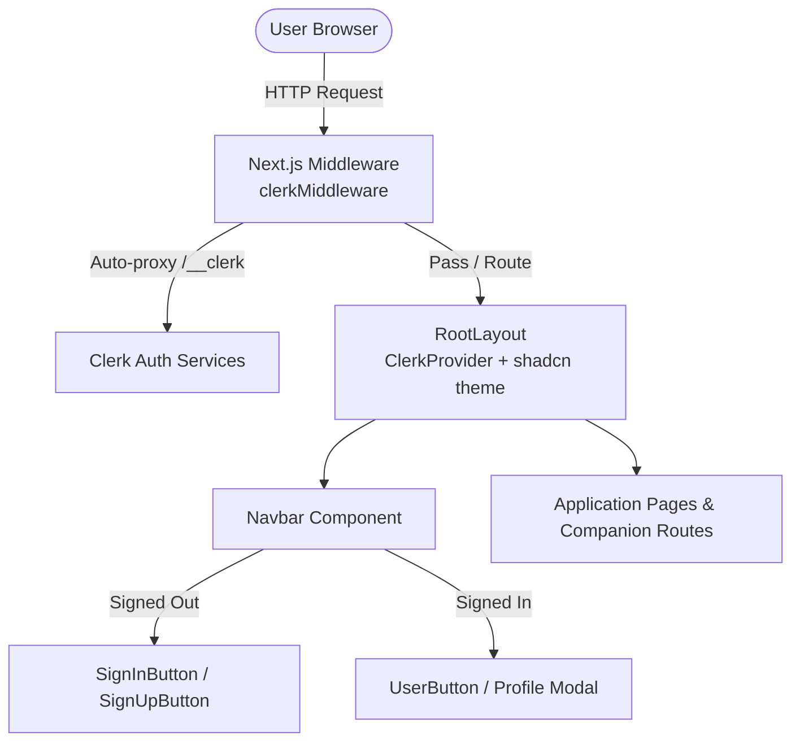

# Requirements

### Overview & Goals
Integrate Clerk authentication into the Converso platform to maximize user security, streamline the onboarding experience, and minimize operational overhead. By leveraging Clerk's managed identity platform and CLI automation, we achieve secure session management, role-ready authentication, and cohesive UI styling with minimal architectural friction.

### Scope
- **In Scope:**
  - Setup and configuration of the Clerk CLI linked to Clerk App ID `app_3KF6uSoIYAlsqxR8gESe1WSlpNb`.
  - Installation of `@clerk/nextjs` and `@clerk/ui` with shadcn theme integration.
  - Integration of `ClerkProvider` inside `<body>` in `app/layout.tsx`.
  - Next.js middleware / proxy configuration with auto-proxy matcher `/__clerk/:path*`.
  - Replacement of placeholder sign-in markup in `components/Navbar.tsx` with active auth controls (`SignInButton`, `SignUpButton`, `UserButton`, `Show`).
  - Verification via `clerk doctor` and end-to-end sign-in/sign-up verification.
- **Out of Scope:**
  - Custom OAuth provider backend integrations (Clerk handles provider routing).
  - Database webhook sync setup (can be added in future iterations as persistence requirements expand).

### User Stories
- **As a visitor**, I want clear and accessible sign-in and sign-up options in the navigation bar so that I can quickly register and access AI teaching companions with minimal effort.
- **As an authenticated user**, I want my profile avatar and account management tools easily reachable in the navigation so that I can manage my session seamlessly.
- **As a developer/maintainer**, I want robust, standard-compliant authentication with automated CLI diagnostics so that security risks, regressions, and maintenance burdens are minimized.

### Functional Requirements
- **Authentication Lifecycle:** Support sign-up, sign-in, session validation, and sign-out across all client and server boundaries.
- **Conditional Navigation Controls:**
  - When signed out: Display "Sign In" and "Sign Up" buttons styled according to project theme (`.btn-signin`, `.btn-primary`).
  - When signed in: Display the user profile trigger (`UserButton`) and active navigation links.
- **Protected Routing & Middleware:** Intercept requests where appropriate and maintain Next.js 15+ async `auth()` compliance and Clerk auto-proxy routes.
- **Consistent UI/UX:** Apply `@clerk/ui` with `shadcn` theme mapping so auth modals and controls harmoniously reflect the application's design system.

### Non-Functional Requirements
- **Security:** Ensure secret keys (`CLERK_SECRET_KEY`) remain strictly on the server and are never bundled into client-side code.
- **Performance:** Asynchronous token resolution and edge-compatible middleware with zero unnecessary client re-renders.
- **Maintainability:** Standard `@clerk/nextjs` integration without proprietary wrapper abstractions that increase technical debt.

# Technical Design

### Current Implementation
- `app/layout.tsx`: Defines `RootLayout` with Google Fonts (`Bricolage Grotesque`, `Inter`) and renders `<Navbar />` followed by `{children}`.
- `components/Navbar.tsx`: Contains navigation links (`<NavItems />`) and a static `<p>Sign In</p>` placeholder.
- `app/globals.css`: Tailwind v4 configuration including `.btn-signin`, `.btn-primary`, and color tokens.
- `components.json`: Configured with `"style": "base-vega"` and neutral shadcn theme tokens.

### Key Decisions
1. **Clerk Provider Placement inside `<body>`:**
   - *Decision:* Place `<ClerkProvider>` inside `<body>` in `app/layout.tsx` around `{children}`.
   - *Rationale:* Avoids hydration discrepancies and follows Next.js HTML tag hierarchy constraints.
2. **Unified shadcn Theming via `@clerk/ui`:**
   - *Decision:* Use `@clerk/ui` with `appearance={{ theme: shadcn }}` and import `@clerk/ui/themes/shadcn.css` in `app/globals.css`.
   - *Rationale:* Delivers maximum visual consistency with existing UI components while avoiding duplicate styling maintenance.
3. **App Router Matcher & Async Auth Pattern:**
   - *Decision:* Standardize middleware / proxy matcher to include `'/(api|trpc)(.*)'` and `'/__clerk/:path*'`.
   - *Rationale:* Guarantees seamless token refresh and auto-proxying across all client-server boundaries without breaking static assets.

### Proposed Changes

#### 1. Environment & Package Dependencies
- Ensure `@clerk/nextjs` and `@clerk/ui` are installed via Bun/npm package manager.
- Link environment variables using `clerk init --app app_3KF6uSoIYAlsqxR8gESe1WSlpNb`.

#### 2. Root Layout Integration (`app/layout.tsx`)
```tsx
import type { Metadata } from "next";
import { Bricolage_Grotesque, Inter } from "next/font/google";
import "./globals.css";
import { cn } from "@/lib/utils";
import Navbar from "@/components/Navbar";
import { ClerkProvider } from "@clerk/nextjs";
import { shadcn } from "@clerk/ui/themes";

const inter = Inter({ subsets: ["latin"], variable: "--font-sans" });
const bricolage = Bricolage_Grotesque({
  variable: "--font-bricolage",
  subsets: ["latin"],
});

export const metadata: Metadata = {
  title: "Converso",
  description: "Real-time AI Teaching Platform",
};

export default function RootLayout({
  children,
}: Readonly<{
  children: React.ReactNode;
}>) {
  return (
    <html lang="en" className={cn("font-sans", inter.variable)}>
      <body className={`${bricolage.variable} antialiased`}>
        <ClerkProvider appearance={{ theme: shadcn }}>
          <Navbar />
          {children}
        </ClerkProvider>
      </body>
    </html>
  );
}
```

#### 3. Navigation Controls (`components/Navbar.tsx`)
```tsx
import React from "react";
import Link from "next/link";
import Image from "next/image";
import NavItems from "@/components/NavItems";
import { SignInButton, SignUpButton, Show, UserButton } from "@clerk/nextjs";

function Navbar() {
  return (
    <nav className={"navbar"}>
      <Link href={"/"}>
        <div className={"flex items-center gap-2.5 cursor-pointer"}>
          <Image src={"/images/logo.svg"} alt={"logo"} width={46} height={44} />
        </div>
      </Link>
      <div className={"flex items-center gap-8"}>
        <NavItems />
        <Show when="signed-out">
          <div className="flex items-center gap-3">
            <SignInButton mode="modal">
              <button className="btn-signin">Sign In</button>
            </SignInButton>
            <SignUpButton mode="modal">
              <button className="btn-primary">Sign Up</button>
            </SignUpButton>
          </div>
        </Show>
        <Show when="signed-in">
          <UserButton />
        </Show>
      </div>
    </nav>
  );
}

export default Navbar;
```

#### 4. Middleware Configuration (`middleware.ts`)
```ts
import { clerkMiddleware } from "@clerk/nextjs/server";

export default clerkMiddleware();

export const config = {
  matcher: [
    // Skip Next.js internals and all static files, unless found in search params
    "/((?!_next|[^?]*\\.(?:html?|css|js(?!on)|jpe?g|webp|png|gif|svg|ttf|woff2?|ico|csv|docx?|xlsx?|zip|webmanifest)).*)",
    // Always run for API routes
    "/(api|trpc)(.*)",
    // Auto-proxy path
    "/__clerk/:path*",
  ],
};
```

### Components
- `app/layout.tsx`: Root shell configured with `ClerkProvider`.
- `components/Navbar.tsx`: Header bar augmented with responsive auth controls (`SignInButton`, `SignUpButton`, `UserButton`, `Show`).
- `middleware.ts`: Request pipeline interceptor validating session tokens and proxy matchers.
- `app/globals.css`: Updated with `@import '@clerk/ui/themes/shadcn.css';`.

### File Structure
```
saas_app/
├── app/
│   ├── globals.css          (modified: add @clerk/ui theme stylesheet)
│   ├── layout.tsx           (modified: wrap body content with ClerkProvider)
│   └── sign-in/
│       └── page.tsx         (modified: mount Clerk SignIn component)
├── components/
│   └── Navbar.tsx           (modified: integrate Show, SignInButton, SignUpButton, UserButton)
├── middleware.ts            (added / verified: clerkMiddleware with auto-proxy matcher)
└── package.json             (modified: @clerk/nextjs, @clerk/ui dependencies)
```

### Architecture Diagram


### Risks & Mitigations
- **Hydration Mismatch:** Mitigated by placing `ClerkProvider` strictly within `<body>` rather than wrapping `<html>`.
- **Missing Proxy Matcher:** Mitigated by explicitly registering `'/__clerk/:path*'` in `middleware.ts`.
- **Environment Key Exposure:** Mitigated by keeping `CLERK_SECRET_KEY` exclusively on the server and using standard `NEXT_PUBLIC_CLERK_PUBLISHABLE_KEY` client-side.

# Testing

### Validation Approach
Automate and verify authentication functionality using CLI tooling and browser-level flows to ensure zero regression and immediate utility.

### Key Scenarios
1. **CLI Diagnostics:**
   - Execute `clerk doctor` to validate environment variable configuration, SDK versions, and proxy matchers.
2. **Signed-Out State Rendering:**
   - Load the homepage and verify that the "Sign In" and "Sign Up" action buttons are visible and properly styled.
   - Verify that protected user-specific components are not visible.
3. **Modal & Flow Verification:**
   - Trigger the "Sign Up" modal, complete a test registration, and confirm session token issuance.
   - Verify that the navigation dynamically transitions to display `<UserButton />`.
4. **Signed-In State & Account Menu:**
   - Click `<UserButton />` to verify the account management popover opens cleanly with shadcn theme styling.
   - Trigger "Sign Out" and confirm immediate transition back to the signed-out state.

### Edge Cases
- Direct navigation to protected or proxy paths (`/__clerk/*`).
- Fast page transitions and session persistence across hard refreshes.
- Graceful degradation when network connectivity to Clerk edge is interrupted.

# Delivery Steps

### ✓ Step 1: Install/update Clerk CLI and initialize Clerk application
Clerk CLI is installed, authenticated, and the project is initialized with the target Clerk application `app_3KF6uSoIYAlsqxR8gESe1WSlpNb`.

- Verify existing Clerk CLI installation via `command -v clerk && clerk --version` and update via `clerk update --yes`, or install globally via `npm install -g clerk` or `bun add -g clerk`.
- Authenticate the CLI session using `clerk auth login`.
- Initialize Clerk in the project via `clerk init --app app_3KF6uSoIYAlsqxR8gESe1WSlpNb` to install `@clerk/nextjs` and configure initial environment variables.

### ✓ Step 2: Configure ClerkProvider, proxy/middleware, and shadcn styling
ClerkProvider is integrated inside `<body>` with shadcn theme tokens, and proxy/middleware matcher rules are verified.

- Wrap the application body in `app/layout.tsx` with `<ClerkProvider appearance={{ theme: shadcn }}>` inside `<body>`.
- Install `@clerk/ui` and import `@clerk/ui/themes/shadcn.css` in `app/globals.css` for consistent design alignment.
- Verify or configure Next.js middleware / proxy routing in `middleware.ts` ensuring the matcher pattern includes `'/(api|trpc)(.*)'` followed by `'/__clerk/:path*'`.

### ✓ Step 3: Implement interactive auth controls in Navbar and route entrypoints
Navbar and route entrypoints provide seamless, reactive sign-in, sign-up, and account management controls.

- Update `components/Navbar.tsx` using `@clerk/nextjs` primitives (`<Show when="signed-out">`, `<SignInButton>`, `<SignUpButton>`, and `<Show when="signed-in">`, `<UserButton>`) styled with `.btn-signin` and `.btn-primary`.
- Configure `app/sign-in/page.tsx` (and `app/sign-up/page.tsx` if needed) with `<SignIn />` / `<SignUp />` components for dedicated landing navigation.

### ✓ Step 4: Run Clerk diagnostics and verify end-to-end authentication flow
Authentication integration passes CLI diagnostics and end-to-end verification.

- Run `clerk doctor` from project root to diagnose configuration, environment keys, and middleware matchers.
- Start the development server (`bun run dev`) and test sign-up, session persistence, profile management via UserButton, and sign-out flows.
- Provide onboarding guidance for testing the first created account and reviewing the Clerk dashboard.